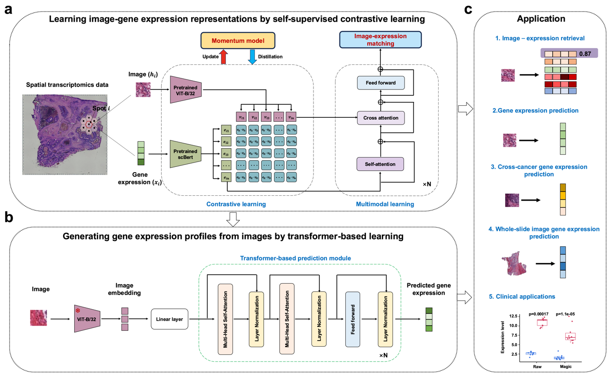

# Magic

## **Spatial histology and gene-expression representation and generative learning via online self-distillation contrastive learning**


## Overview

**Overview of the Magic model**. **a** Using images and gene expression data from ST as inputs, Magic employs two encoders, Vision Transformer and Transformer-based encoder (I(∙) and G(∙)), to extract features from each modality. Contrastive learning is then used to align these two features in a lower-dimensional representation space, while a momentum distillation mechanism assists feature extraction. Additionally, a feature fusion module, consisting of self-attention, cross-attention, and feed-forward mechanisms, is used to capture the internal relationships of gene expression features and to integrate image and gene expression features. **b** Magic uses the image encoder I(∙), pretrained during the first stage, to extract image features. These features are then decoded using multilayer linear expansion and a Transformer decoder, yielding a gene expression prediction, G<sub>pred</sub>, with a length of 300.

## Checkpoint

A pre-trained model checkpoint for ScBert can be downloaded from this link. https://drive.weixin.qq.com/s?k=AJEAIQdfAAoUxhXE7r. Furthermore, if you would like to explore the model code of ScBert in more detail, you can access the official repository via the following link: https://github.com/TencentAILabHealthcare/scBERT. Additionally, the pre-trained weights for the Vision Transformer (ViT) model used in our framework can be directly downloaded from this link: https://dl.fbaipublicfiles.com/deit/deit_base_patch16_224-b5f2ef4d.pth.

## Installation

Installation was tested on ubuntu 20.04 with Python 3.8.19 and torch 2.4.0 on a machine with one 16-core AMD Ryzen 9 5950X CPU addressing with 64GB RAM, and two NVIDIA 3090 GPU addressing 24GB. Magic is implemented in the Pytorch framework. Please run Magic on CUDA if possible.

### 1. Grab source code of Magic

```bash
git clone https://github.com/cat-moom/Magic.git
cd Magic
```

### 2. Install Magic in the virtual environment by conda

* Please enter the following command in the terminal to create a virtual environment for Magic to run and enter the virtual environment you created:

```bash
conda create --name Magic --file requirements.txt
conda activate Magic
```

## Data preprocessing

### 1. Histology image and Gene expression preprocessing

Running the following code will segment the tissue slice images in the spatial transcriptomics dataset into multiple spots.

```bash
python image_tilling.py
```

Running this code will extract the top 300 common highly expressed genes across all slices.

```bash
python make_decoder_data.py
```

### 2. Dataset Directory

The dataset for Magic should be placed in a folder named data. The dataset path within the data folder is as follows.

```bash
├─data  
│   ├─Breast_cancer     
│   │  ├─1142243F   
│   │  │  ├─filtered_feature_bc_matrix_decoder.h5ad     
│   │  │  └─filtered_feature_bc_matrix_one.h5ad     
│   ├─Breast_cancer_image_process   
│   │  ├─1142243F   
```

## Quick start

### Model Training

#### Input

We take a breast cancer tissue slice dataset as an example input, which includes two types of files: (1) processed gene expression data and (2) image patches. These input files are available at data folder.

#### Run

Magic training consists of two stages. First, execute the command in the Linux Bash Shell to train the Image-gene expression representation learning stage. Then, execute the second command to train the Image-to-gene expression data generative learning stage.

```bash
# The first stage training code
python train-mymodel.py

# The second stage training code
python train-decoder
```

The code from the first stage of training is saved in the encoder_model folder. Before starting the second stage of training, please modify the model loading path in the model/stage_two.py file to point to the model weights saved after the first stage. The code from the second stage of training is saved in the decoder_model folder.

**Hyperparameters**

The hyperparameters of the training code for both stages are the same, which are as follows:

* batch_size: defines the batch size for training model. The default value is 32. You can modify it based on your memory size. The larger the parameter, the less time.
* Init_Epoch: defines the starting epoch number for training. Default value is 0. Usually does not need to be changed if you are training from scratch.
* Epoch: defines the max iteration for training model. The default value is 100. You can modify it. The smaller the parameter, the less time.
* Init_lr: defines the initial learning rate for training. The default value is 1e-4. The learning rate determines the step size for each parameter update. A smaller learning rate can help prevent unstable training but may result in slower convergence.。
* Min_lr: defines the minimum learning rate. The default value is Init_lr * 0.01, meaning that the learning rate will gradually decrease during training until it reaches this minimum value.
* momentum: defines the decay rate of the first-moment estimate in the optimizer. The default value is 0.9. You can modify it according to your needs. The larger the value, the faster the model converges, but it may cause unstable training.
* weight_decay: weight_decay: defines the weight decay value (L2 regularization term). The default value is 1e-2. You can modify it. The larger the parameter, the better it can reduce overfitting.
* lr_decay_type: efines the type of learning rate decay. The default value is 'cos'.

### Model testing

#### Matching images and gene expression

Our model can find the gene expression that best matches the input image from multiple samples. You can run the following commands in Linux Bash Shell to test model accuracy.

```bash
python get_accuracy_image.py
```

#### Predicting gene expression from histological images

You can run the following line of code to test the similarity between the gene expression predicted by the model and the observed gene expression:

```bash
python decoder_Similarity.py
```

## More tutorials

We will continue to update in the future, introducing more detailed tutorials and further visualizations

## References

## Citation
